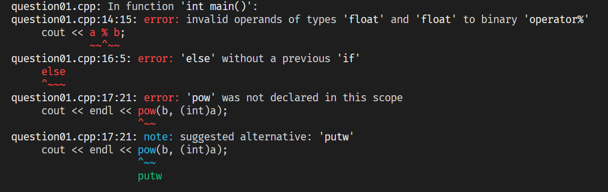

# Question 1

### Identify the types of error(s) in the given code and rewrite the code after correcting error(s).

## Difficulty Level
    
Easy

## HINTS

*Upon execution of the given code, these errors show up :*

