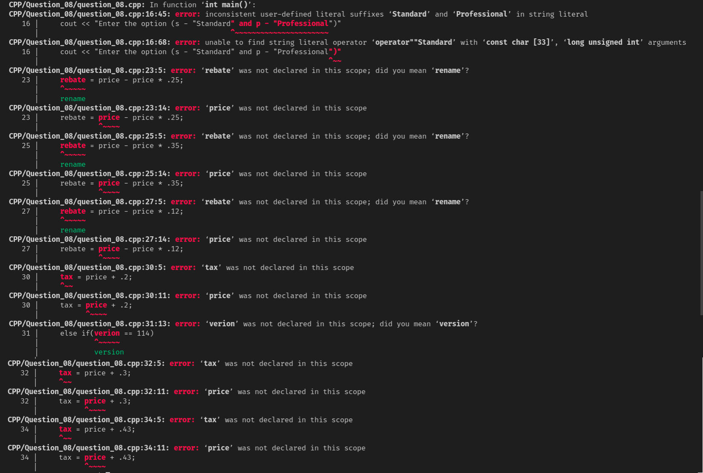

# Question 8

### Vignesh was asked to implement a code using switch case statements. But he has done it using if-else ladder and lots of bugs. Help him out by correcting the given code using nested switch replacing if-else-if.

## Difficulty Level

Hard

## HINTS

*Upon execution of the given code, these errors show up :*

