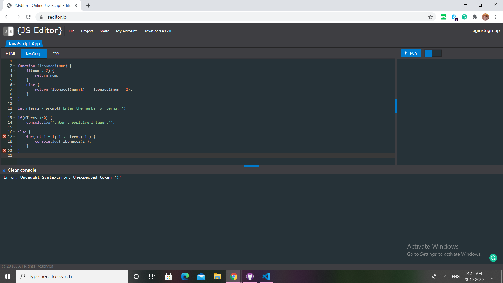

# Question 11

#### program to display fibonacci sequence using recursion

## Difficulty Level

Easy

## Program after successful execution

```
input:5
output:
0
1
1
2
3
```

## Hints

*Upon execution of the given code, we get this output :*


