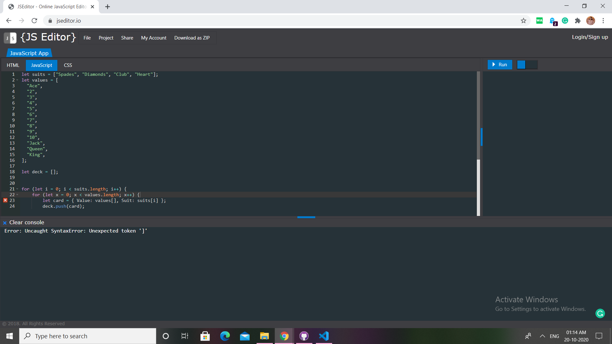

# Question 12

#### program to shuffle the deck of cards

## Difficulty Level
Easy

## Program after successful execution

```
The first five cards are:
4 of Club
5 of Diamonds
Jack of Diamonds
2 of Club
4 of Spades
```

## Hints

*Upon execution of the given code, we get this output :*


