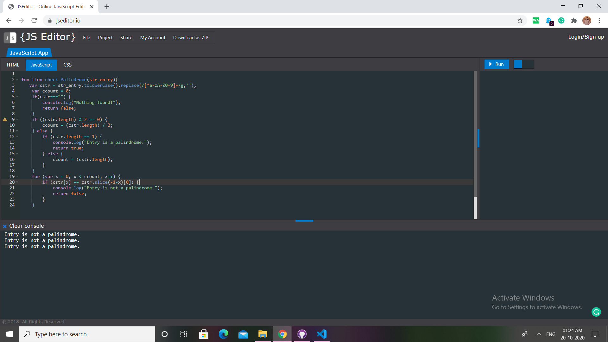

# Question 14

## Problem Description

#### checks whether a passed string is palindrome or not? 


## Difficulty Level
Easy

## Program after successful execution

```
Entry is not a palindrome.
The entry is a palindrome.
Entry is not a palindrome.
```

## Hints

*Upon execution of the given code, we get this output :*


