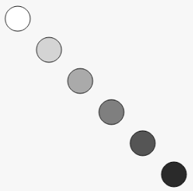
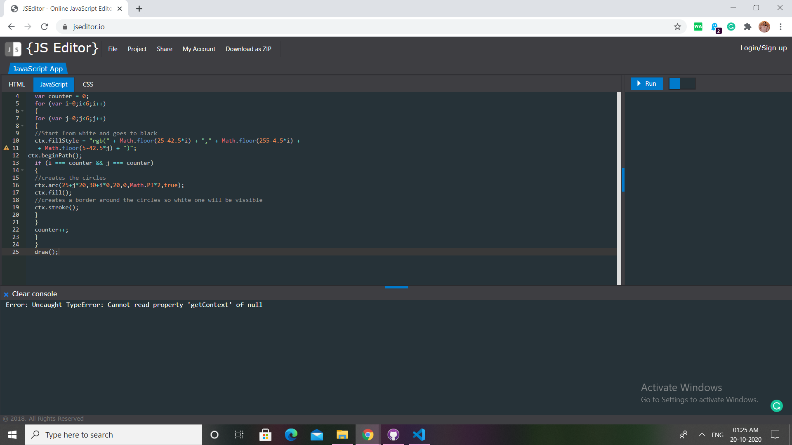

# Question 15

#### A JavaScript program to draw small circles.

## Difficulty Level

Medium

## Program after successful execution

## Hints

*Upon execution of the given code, we get this output :*

