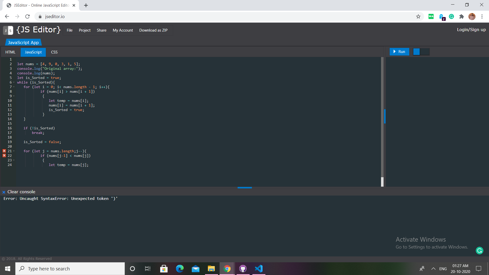

# Question 17

## Problem Description

#### Write a JavaScript program to sort a list of elements using Cocktail shaker sort

It is a variation of bubble sort that is both a stable sorting algorithm and a comparison sort. The algorithm differs from a bubble sort in that it sorts in both directions on each pass through the list. This sorting algorithm is only marginally more difficult to implement than a bubble sort, and solves the problem of turtles in bubble sorts. It provides only marginal performance improvements

## Difficulty Level

Medium

## Program after successful execution

```
Original array:
[4,9,0,3,1,5]
Sorted array:
[0,1,3,4,5,9]
```

## Hints

*Upon execution of the given code, we get this output :*


