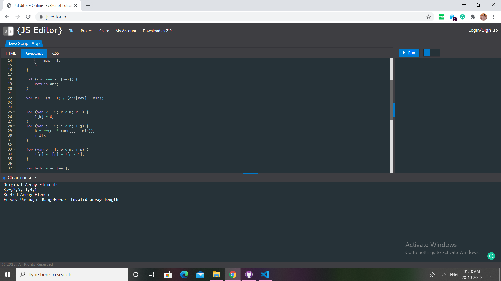

# Question 18

## Problem Description

#### Write a JavaScript program to sort a list of elements using Flashsort

Flashsort is a distribution sorting algorithm showing linear computational complexity O(n) for uniformly distributed data sets and relatively little additional memory requirement. The original work was published in 1998 by Karl-Dietrich Neubert.
The basic idea behind flashsort is that in a data set with a known distribution, it is easy to immediately estimate where an element should be placed after sorting when the range of the set is known.

## Difficulty Level

Hard

## Program after successful execution

```
Original Array Elements
[3,0,2,5,-1,4,1]
Sorted Array Elements
[-1,0,1,2,3,4,5]
```

## Hints

*Upon execution of the given code, we get this output :*


