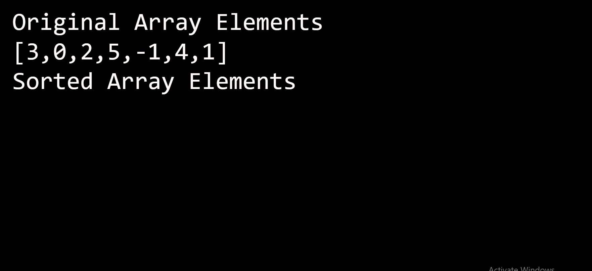

# Question 19

## Problem Description

#### Write a JavaScript program to sort a list of elements using Comb sort.

The Comb Sort is a variant of the Bubble Sort. Like the Shell sort, the Comb Sort increases the gap used in comparisons and exchanges. Some implementations use the insertion sort once the gap is less than a certain amount. The basic idea is to eliminate turtles, or small values near the end of the list, since in a bubble sort these slow the sorting down tremendously. Rabbits, large values around the beginning of the list, do not pose a problem in bubble sort. <br>
In bubble sort, when any two elements are compared, they always have a gap of 1. The basic idea of comb sort is that the gap can be much more than 1.

## Difficulty Level

Hard

## Program after successful execution

```
Original Array Elements
[3,0,2,5,-1,4,1]
Sorted Array Elements
[-1,0,1,2,3,4,5]
```

## Hints

*Upon execution of the given code, we get this output :*


